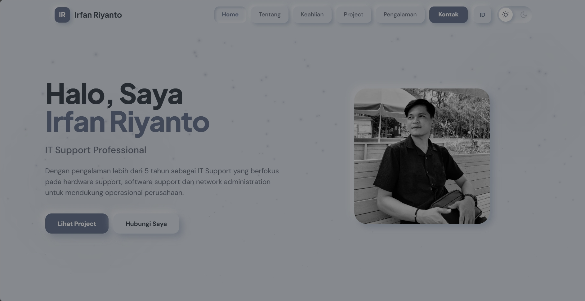
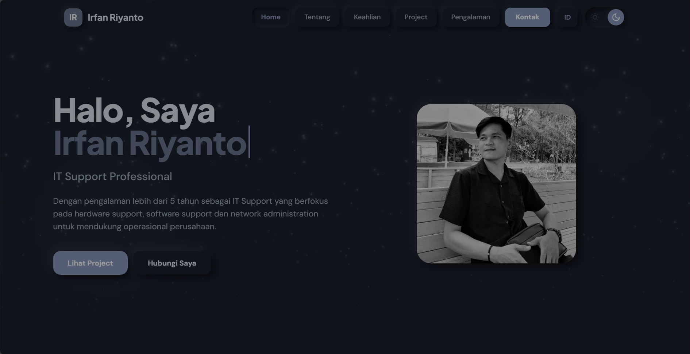
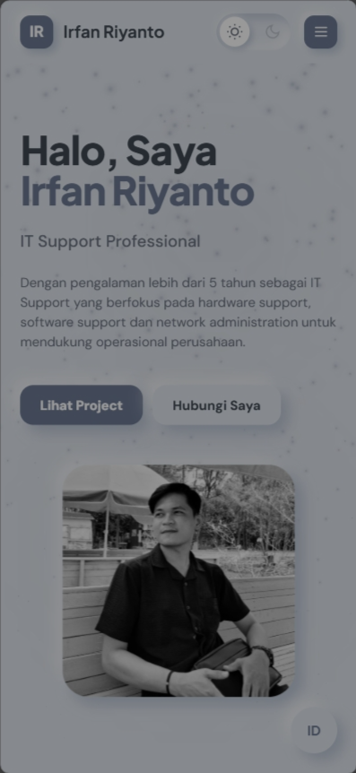

# Website Portofolio - Irfan Riyanto

Website portofolio pribadi dengan desain Neumorphism (Soft UI) yang modern dan elegant untuk IT Support Professional.


## 📸 Screenshots

### 🌞 Light Mode
<div align="center">
  
  
</div>

### 🌙 Dark Mode
<div align="center">
  
  
</div>

### 📱 Mobile Responsive
<div align="center">
  
  
  
</div>

### ✨ Special Features
<div align="center">
  
  
</div>

---

## ✨ Fitur Utama

### 🎨 Design & UI
- **Neumorphism Design System** dengan warna Cool Grey (#6D7993) yang soft dan elegant
- **Dark Mode / Light Mode** dengan modern toggle switch (sun/moon icons)
- **Bilingual Support (ID/EN)** - Website mendukung 2 bahasa dengan language toggle
- **Fully Responsive** - Mobile-first design untuk semua device
- **Floating Particles Effect** - Partikel animasi yang melayang di background (50+ particles)
- **Smooth Neumorphic Shadows** - Shadow yang adaptif untuk light & dark mode

### 🌐 Multi-Language
- **Language Toggle Desktop** - Tombol neumorphic di navigation bar
- **Language Toggle Mobile** - Floating button di kanan bawah layar
- **LocalStorage Persistence** - Bahasa tersimpan dan tidak reset saat refresh
- **Smooth Translation** - Semua text berubah secara instant tanpa reload
- **Complete Coverage** - Semua section ditranslate (Navigation, Hero, About, Skills, Projects, Experience, Contact, Footer)

### 🎭 Animasi & Efek
- **Interactive Loading Screen** - Grid reveal animation dengan neumorphic blocks di seluruh layar
  - Grid blocks dengan random delay dan rotation
  - Corner accents dengan pulse effect
  - Floating particles dari bawah ke atas
  - Center brand logo dengan floating animation
  - Progress bar dengan gradient fill
  - Loading text dengan letter-spacing animation
- **AOS (Animate On Scroll)** - Fade in animations saat scroll
- **Typing Animation** - Efek typing pada nama di hero section
- **Floating Background Circles** - Animated gradient orbs
- **Counter Animation** - Animated statistics (5+ tahun, 200+ perangkat, 95% resolusi)
- **3D Tilt Effect** - Cards dengan hover tilt effect
- **Parallax Mouse Movement** - Subtle parallax pada cards
- **Image Zoom on Hover** - Project images dengan zoom effect
- **Button Ripple Effect** - Material design ripple pada buttons
- **Scroll Progress Indicator** - Progress bar di top page (3px)
- **Icon Pulse Animation** - Icons dengan pulse effect on hover
- **Shimmer Effect** - Subtle shimmer pada card hover
- **Easter Egg** - Konami code untuk rainbow animation

### 🧭 Navigation & UX
- **Active Menu Indicators** - Menu aktif dengan inset shadow effect (tanpa underline)
- **Smooth Scroll** - Smooth scrolling dengan offset
- **Mobile Menu** - Hamburger menu untuk mobile devices
- **Sticky Navigation** - Navbar tetap di atas saat scroll
- **Theme Persistence** - Dark/Light mode preference tersimpan di localStorage
- **Language Persistence** - Pilihan bahasa tersimpan di localStorage
- **Neumorphic Buttons** - Semua buttons menggunakan neumorphic shadow yang konsisten

### 📄 Sections
- **Hero Section** - Dengan space untuk foto profil (350x350px)
- **About Section** - Deskripsi profesional dengan icon
- **Skills Section** - 6 keahlian teknis dengan neumorphic cards
- **Projects Section** - 4 project portfolio dengan screenshot space (240px height)
- **Experience Section** - Timeline pengalaman kerja dengan statistics
- **Contact Section** - Form kontak + 4 contact cards (Email, LinkedIn, GitHub, Instagram)

### 🔧 Technical Features
- **Form Validation** - Client-side validation untuk contact form
- **Social Media Integration** - Links ke Email, LinkedIn, GitHub, Instagram
- **SEO Friendly** - Meta tags dan semantic HTML
- **Performance Optimized** - Lazy loading dan optimized animations
- **Accessibility** - Keyboard navigation dan ARIA labels

## 📁 Struktur File

```
portofolio/
├── index.html          # File HTML utama dengan semua sections
├── style.css           # Stylesheet dengan neumorphic design system
├── script.js           # JavaScript untuk animations & interactivity
├── assets/             # Folder untuk gambar dan media
│   ├── .gitkeep                    # Placeholder untuk folder kosong
│   ├── profile-photo.jpg           # Foto profil Anda (350x350px)
│   ├── rukunapp-screenshot.jpg     # Screenshot RukunApp
│   ├── umkmtegal-screenshot.jpg    # Screenshot UMKMTegal
│   ├── ngopitegal-screenshot.jpg   # Screenshot NgopiTegal
│   └── klaim-edp-screenshot.jpg    # Screenshot Klaim EDP CRB
└── README.md           # Dokumentasi project
```

## 🚀 Cara Menggunakan

### 1. Clone Repository

```bash
git clone https://github.com/irfanriyanto/Portofolio.git
cd Portofolio
```

### 2. Tambahkan Foto Profil

Letakkan foto profil Anda di folder `assets/` dengan nama `profile-photo.jpg`

**Rekomendasi:**
- Format: JPG atau PNG
- Ukuran: 350x350px (square/persegi)
- Resolusi: Minimal 700x700px untuk retina display
- Background: Solid color atau blur untuk tampilan profesional
- Lighting: Natural light dengan pencahayaan yang baik

### 3. Tambahkan Screenshot Project

Letakkan screenshot project Anda di folder `assets/` dengan nama:
- `rukunapp-screenshot.jpg`
- `umkmtegal-screenshot.jpg`
- `ngopitegal-screenshot.jpg`
- `klaim-edp-screenshot.jpg`

**Rekomendasi:**
- Format: JPG atau PNG
- Aspect Ratio: 16:9 (landscape)
- Resolusi: Minimal 1200x675px
- Ukuran file: Maksimal 500KB per gambar (gunakan compression)
- Konten: Tampilkan UI/fitur terbaik dari project

### 4. Customize Konten

Edit file `index.html` untuk mengubah:
- **Personal Info**: Nama, email, LinkedIn, GitHub, Instagram
- **Hero Section**: Tagline dan deskripsi
- **About Section**: Deskripsi profesional Anda
- **Skills Section**: Keahlian teknis yang Anda miliki
- **Projects Section**: Detail project (nama, deskripsi, tech stack, features)
- **Experience Section**: Pengalaman kerja dan achievements
- **Contact Info**: Email dan social media links

### 5. Buka Website

Buka file `index.html` di browser Anda untuk melihat hasilnya.

```bash
# Atau gunakan live server
# Jika menggunakan VS Code, install extension "Live Server"
# Klik kanan pada index.html > Open with Live Server
```

## 🛠️ Teknologi yang Digunakan

- **HTML5** - Semantic markup
- **CSS3** - Neumorphism Design System dengan CSS Variables
- **JavaScript (Vanilla)** - No framework, pure JS untuk performa optimal
- **Tailwind CSS** (via CDN) - Utility-first CSS framework
- **AOS Library** - Animate On Scroll
- **Google Fonts** - Plus Jakarta Sans & DM Sans

## 🎨 Design System

### Warna Palette

**Light Mode:**
- **Accent**: `#6D7993` (Lavender/Slate Blue)
- **Background**: `#E0E5EC` (Cool Grey)
- **Text Primary**: `#3D4852` (Dark Blue Grey)
- **Text Secondary**: `#6B7280` (Medium Grey)
- **Shadow Light**: `rgba(163, 177, 198, 0.6)`
- **Shadow Highlight**: `rgba(255, 255, 255, 0.5)`

**Dark Mode:**
- **Accent**: `#8B9DC3` (Light Lavender)
- **Background**: `#1A202C` (Dark Blue Grey)
- **Text Primary**: `#E2E8F0` (Light Grey)
- **Text Secondary**: `#A0AEC0` (Medium Light Grey)
- **Shadow Dark**: `rgba(0, 0, 0, 0.5)`
- **Shadow Highlight**: `rgba(255, 255, 255, 0.05)`

### Typography
- **Display Font**: Plus Jakarta Sans (500, 600, 700, 800)
- **Body Font**: DM Sans (400, 500, 700)
- **Line Height**: 1.6
- **Font Smoothing**: Antialiased

### Neumorphic Shadows
```css
/* Extruded (Raised) */
box-shadow: 9px 9px 16px var(--shadow-light-1), 
            -9px -9px 16px var(--shadow-light-2);

/* Inset (Pressed) */
box-shadow: inset 6px 6px 10px var(--shadow-light-1), 
            inset -6px -6px 10px var(--shadow-light-2);
```

### Border Radius
- **Small**: 12px (buttons, badges)
- **Medium**: 16px (inputs, small cards)
- **Large**: 24px (contact cards)
- **Extra Large**: 32px (main cards)

### Spacing Scale
- **Base**: 8px
- **Scale**: 4px, 8px, 12px, 16px, 20px, 24px, 32px, 40px, 48px

## 🎬 Animasi & Efek

### Interactive Loading Screen
- **Grid Blocks**: 50 kotak neumorphic tersebar di seluruh layar
  - Random delay untuk staggered effect
  - Rotation 360° saat muncul
  - Scale animation dari 0.5 ke 1.0
- **Corner Accents**: 4 lingkaran accent di setiap sudut
  - Pulse effect dengan delay berbeda
  - Opacity berubah dari 0.15 ke 0.3
- **Floating Particles**: 4 partikel melayang dari bawah ke atas
  - Horizontal drift animation
  - Fade in/out effect
- **Center Brand**: Logo "IR" dengan floating animation
  - TranslateY dan rotate effect
  - Neumorphic shadow yang dalam
- **Progress Bar**: Inset neumorphic dengan gradient fill
  - Width animation dari 0% ke 100%
  - Smooth 2 second duration
- **Loading Text**: "LOADING" dengan letter-spacing animation
  - Letter-spacing berubah dari 4px ke 6px
  - Opacity pulse effect
- **Duration**: 2.2 detik total
- **Responsive**: Adaptif untuk mobile dan desktop

### Language Toggle Buttons
- **Desktop Button**: 44x44px dengan border-radius 12px
  - Neumorphic extruded shadow
  - Hover: translateY(-2px) + enhanced shadow
  - Active: Inset shadow (pressed effect)
  - Ripple animation saat diklik
- **Mobile Floating Button**: 56x56px bulat (border-radius 50%)
  - Fixed position di bottom-right (24px dari tepi)
  - Hover: translateY(-3px) + scale(1.05)
  - Active: Inset shadow + scale(1)
  - Hidden di desktop (≥768px)
- **Color**: Accent color untuk text
- **Font**: Plus Jakarta Sans, bold, 14-16px
- **Transition**: Smooth 0.3s cubic-bezier

### Floating Particles
- **Jumlah**: 50+ particles
- **Ukuran**: 4px - 14px (random)
- **Durasi**: 10-18 seconds (random)
- **Drift**: ±150px horizontal movement
- **Opacity**: Fade in/out animation
- **Z-index**: 0 (behind all content)

### Scroll Animations (AOS)
- **Duration**: 800ms
- **Easing**: ease-out
- **Offset**: 100px
- **Delay**: 100-300ms (staggered)

### Hover Effects
- **Cards**: translateY(-2px) + enhanced shadow
- **Buttons**: translateY(-1px) + scale(1.02)
- **Icons**: pulse animation + scale(1.05)
- **Images**: scale(1.05) + smooth transition

### Active States
- **Navigation**: Inset shadow (pressed effect)
- **Buttons**: Deeper inset + scale(0.98)
- **No underlines**: Clean neumorphic style only

## 🌐 Browser Support

- ✅ Chrome (latest)
- ✅ Firefox (latest)
- ✅ Safari (latest)
- ✅ Edge (latest)
- ✅ Mobile browsers (iOS Safari, Chrome Mobile)

## 💡 Tips & Best Practices

### Optimasi Gambar
1. **Compress gambar** sebelum upload (gunakan TinyPNG atau Squoosh)
2. **Target size**: < 500KB per gambar
3. **Format**: WebP untuk modern browsers, fallback ke JPG
4. **Dimensi**: Sesuaikan dengan ukuran display (jangan terlalu besar)

### Foto Profil Profesional
1. **Background**: Solid color atau blur (hindari background ramai)
2. **Lighting**: Natural light dari depan/samping
3. **Attire**: Professional/business casual
4. **Expression**: Friendly dan approachable
5. **Framing**: Head and shoulders, centered

### Screenshot Project
1. **Pilih view terbaik**: Dashboard, main feature, atau UI yang menarik
2. **Clean data**: Gunakan dummy data yang terlihat real
3. **Consistent style**: Semua screenshot dengan style yang sama
4. **Highlight features**: Tunjukkan fitur unik dari project

### Performance
1. **Lazy loading**: Images akan load saat dibutuhkan
2. **Minify**: Minify CSS & JS untuk production
3. **CDN**: Gunakan CDN untuk libraries (Tailwind, AOS, Fonts)
4. **Caching**: Set proper cache headers di hosting

### SEO
1. **Meta tags**: Update title, description, dan keywords
2. **Alt text**: Tambahkan alt text pada semua images
3. **Semantic HTML**: Gunakan proper heading hierarchy (h1, h2, h3)
4. **Open Graph**: Tambahkan OG tags untuk social media sharing

## 🎯 Roadmap & Future Enhancements

### ✅ Completed
- [x] Bilingual support (ID/EN) dengan language toggle
- [x] Neumorphic language toggle buttons (desktop & mobile)
- [x] Interactive loading screen dengan grid reveal animation
- [x] LocalStorage untuk theme dan language persistence
- [x] Floating particles background effect
- [x] Dark mode dengan smooth transition

### Prioritas Tinggi
- [ ] Skills Progress Bars dengan animated percentage
- [ ] Back to Top Button (floating)
- [ ] Download CV/Resume button
- [ ] Project links (Live Demo, GitHub repo)
- [ ] Social media links di footer

### Prioritas Medium
- [ ] Testimonials/Recommendations section
- [ ] Certifications & Awards section
- [ ] Timeline visual untuk pengalaman
- [ ] Project filters by technology
- [ ] Contact form integration (EmailJS/Formspree)
- [ ] More language options (EN, JP, etc)

### Prioritas Low
- [ ] Blog section
- [ ] Print-friendly CV version
- [ ] Analytics integration (Google Analytics)
- [ ] PWA support
- [ ] Voice command navigation

## 📝 Lisensi

Free to use untuk personal portfolio.

## 🤝 Contributing

Contributions, issues, and feature requests are welcome!

## 👨‍💻 Author

**Irfan Riyanto**
- GitHub: [@irfanriyanto](https://github.com/irfanriyanto)
- LinkedIn: [Irfan Riyanto](https://linkedin.com/in/irfanriyanto)

---

⭐ **Dibuat dengan ❤️ menggunakan Neumorphism Design System**

*Portfolio website untuk IT Support Professional dengan 5+ tahun pengalaman*
